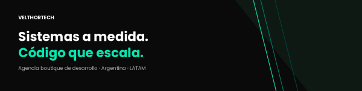
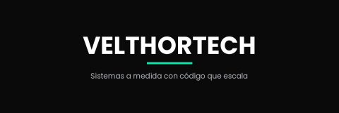

<!--
═══════════════════════════════════════════════════════════════════
  README de la organización Velthortech en GitHub
═══════════════════════════════════════════════════════════════════

  Este archivo va en un repo especial llamado `.github` dentro de la
  organización, en la ruta: `.github/profile/README.md`

  GitHub lo renderiza automáticamente como portada de la org cuando
  alguien entra a github.com/velthortech

  📝 PARA EDITAR ANTES DE PUBLICAR:
  1. Subir los 2 banners al repo en `.github/profile/assets/`
     - banner-hero.png (panorámico, "Sistemas a medida. Código que escala.")
     - banner-cierre.png (cuadrado-ish, mismo tagline — regenerar para
       que coincida con el del hero)
  2. Reemplazar [EMAIL] con el email de contacto cuando lo tengan
  3. Reemplazar [SITIO] con velthortech.com cuando esté la landing
  4. Reemplazar [CAL-LINK] con el link de Cal.com cuando esté

  Las URLs de los banners están con la ruta relativa al repo `.github`,
  asumiendo que subís los archivos a /profile/assets/. Si los subís a
  otra ruta, ajustá los src de los .
─────────────────────────────────────────────────────────────────── -->

<!-- Banner principal — panorámico -->

 
 

 

---

Somos una agencia boutique de desarrollo. Trabajamos con empresas que necesitan un sistema a medida — un CRM propio, un panel interno, un dashboard para su operación — y no quieren irse a una solución genérica que termine costándoles más en el largo plazo.

Cada cliente es un proyecto cerrado, con su propio repositorio y su propia infraestructura. Nada está compartido. Lo que vendemos es código tuyo, en tu servidor, hecho para tu operación.

 

## Cómo trabajamos

**Empezamos con un discovery.** Una hora de call, sin compromiso, para entender qué problema están tratando de resolver. Si lo que necesitan no es algo que podemos hacer bien, te lo decimos en esa misma reunión y te recomendamos a alguien que sí.

**Cotizamos por proyecto, no por hora.** Sabés desde el día uno cuánto va a salir y cuándo te entregamos. El cobro es escalonado: una parte al arranque, otra al hito intermedio, el resto contra entrega final.

**Te entregamos algo terminado, no un MVP infinito.** Cuando decimos que un proyecto sale en 6 semanas, sale en 6 semanas. Si ofrecemos mantenimiento mensual después, es porque queremos seguir trabajando con vos — no porque te dejamos algo a medio hacer para amarrarte.

 

## En qué creemos

**Solidez técnica.** Código que se entiende, que se puede modificar sin romperlo, que no depende de nadie en particular para sobrevivir. Si mañana cambiás de proveedor, te llevás un proyecto que cualquier dev decente puede continuar.

**Modernidad sin moda.** Usamos las herramientas que mejor resuelven el problema, no las que están de moda esta semana. Las decisiones técnicas duran años, las modas duran meses.

**Confianza profesional.** Plazos reales, comunicación clara, contratos directos sin letra chica. Lo que decimos en la reunión de venta es exactamente lo que hacemos en la ejecución.

 

---

## Trabajemos juntos

Si tenés un proyecto en la cabeza y querés que lo conversemos, escribinos.

 

 
 

<!-- Banner de cierre — la frase queda flotando como firma -->

 
 

Velthortech · Buenos Aires, Argentina · 2026

